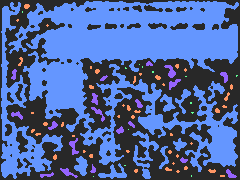
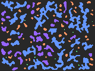
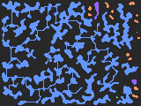

#  TerrainForge

[](https://www.rust-lang.org/)
[](https://opensource.org/licenses/MIT)
[](https://crates.io/crates/terrain-forge)
[](https://docs.rs/terrain-forge)
[](https://github.com/EliasVahlberg/terrain-forge/actions)



A comprehensive Rust library for procedural terrain and dungeon generation with semantic analysis capabilities.

Crates.io: https://crates.io/crates/terrain-forge

Migration: [v0.6.0 guide](docs/MIGRATION_0_6.md)

## Features

- **16 Generation Algorithms**: BSP, Cellular Automata, WFC, Delaunay Triangulation, Glass Seam Bridging, Noise Fill, and more
- **Spatial Analysis**: Distance transforms, pathfinding, morphological operations
- **Semantic Layers**: Game-agnostic metadata for entity spawning and region analysis
- **Advanced Prefab System**: JSON/TOML support with transformations
- **Requirements System**: Generate maps meeting specific constraints
- **Connectivity Utilities**: Shortest-path extraction, path carving, marker connections

## Quick Start

```toml
[dependencies]
terrain-forge = "0.5"
```

```rust
use terrain_forge::{Grid, ops};

fn main() {
    let mut grid = Grid::new(80, 60);
    ops::generate("bsp", &mut grid, Some(12345), None).unwrap();
    println!("Generated {} floor tiles", grid.count(|t| t.is_floor()));
}
```

## Novel Algorithm: Glass Seam Bridging

The **Glass Seam Bridging Algorithm** is a novel connectivity algorithm designed specifically for TerrainForge. It ensures map connectivity by finding the optimal set of tunnels to connect disconnected floor regions while minimizing total tunnel length.

📄 **[Read the full algorithm specification](docs/paper/GLASS_SEAM_BRIDGING_ALGORITHM.md)**  
📄 **[Download the research paper (PDF)](docs/paper/glass_seam_bridging_paper.pdf)**

Key features:

- **Perimeter Gradient Descent (PGD)** optimization for optimal tunnel endpoints
- **Edge pruning pipeline** with Delaunay triangulation, angular sector, and occlusion filters
- **Multi-terminal support** for connecting spawn points, exits, and POIs
- **Configurable optimization profiles** from real-time to quality-focused generation

### Connectivity Demonstration

| Before GSB                                                                    | After GSB                                                                   |
| ----------------------------------------------------------------------------- | --------------------------------------------------------------------------- |
|  |  |
| **97 disconnected regions** (highly fragmented)                               | **23 connected regions** (76% reduction)                                    |
| **0.21 connectivity** • **29.1% floors**                                      | **0.78 connectivity** • **31.2% floors**                                    |

_Color-coded semantic analysis showing dramatic connectivity improvement (+0.57 connectivity, +2.1% floors) on cellular automata caves (160×120 grid)_

## Algorithms

| Algorithm        | Description                                  | Semantic Support |
| ---------------- | -------------------------------------------- | ---------------- |
| `bsp`            | Binary Space Partitioning - structured rooms | ✅ `for_rooms()` |
| `cellular`       | Cellular Automata - organic caves            | ✅ `for_caves()` |
| `dla`            | Diffusion Limited Aggregation                | ✅ `default()`   |
| `drunkard`       | Drunkard Walk - winding passages             | ✅ `default()`   |
| `maze`           | Perfect maze generation                      | ✅ `for_mazes()` |
| `rooms`          | Simple room placement                        | ✅ `for_rooms()` |
| `voronoi`        | Voronoi diagram regions                      | ✅ `default()`   |
| `wfc`            | Wave Function Collapse                       | ✅ `default()`   |
| `enhanced_wfc`   | WFC with pattern learning                    | ✅ `default()`   |
| `percolation`    | Physics-based generation                     | ✅ `default()`   |
| `diamond_square` | Fractal heightmaps                           | ✅ `default()`   |
| `fractal`        | Fractal terrain                              | ✅ `default()`   |
| `noise_fill`     | Noise-driven threshold fill                  | ✅ `default()`   |
| `agent`          | Multi-agent carving                          | ✅ `default()`   |
| `glass_seam`     | Region connector                             | ✅ `default()`   |
| `room_accretion` | Brogue-style organic dungeons                | ✅ `for_rooms()` |

## Documentation

- **[Usage Guide](USAGE.md)** - Comprehensive examples and API documentation
- **[Patch Notes](PATCHNOTES.md)** - Detailed version history and changes
- **[API Documentation](https://docs.rs/terrain-forge/0.5.0)** - Complete API reference

## Version History

- **v0.4.0** - Spatial Analysis & Quality of Life improvements
- **v0.3.0** - Semantic Layers and Requirements System
- **v0.2.0** - Advanced Algorithms (WFC, Percolation, Fractal)
- **v0.1.0** - Foundation with core algorithms and grid system

## Demo Framework

```bash
# Generate basic terrain
cargo run --bin demo -- gen bsp -s 12345 -o output.png

# Semantic generation with visualization
cargo run --bin demo -- gen room_accretion --semantic --text -o semantic.txt

# Compare algorithms
cargo run --bin demo -- compare bsp cellular maze -s 12345
```

## License

Licensed under the MIT License. See [LICENSE](LICENSE) for details.
