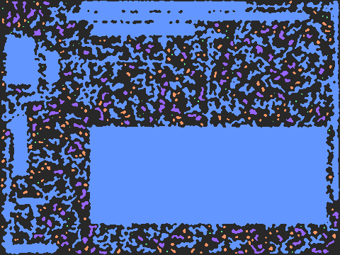

#  TerrainForge

<div align="center">
  
  <p><em>BSP → Cellular pipeline generating structured caves (480×360, 426 regions, 119 markers)</em></p>
</div>

A modular procedural generation engine for terrain, dungeons, and maps in Rust.

**🎯 Now with Semantic Layers in v0.3.0!**

## Features

- **🎯 Semantic Layers**: Game-agnostic metadata for entity spawning and region analysis
- **14 Generation Algorithms**: BSP, Cellular Automata, DLA, Drunkard Walk, Maze, Rooms, Voronoi, WFC, Percolation, Diamond Square, Fractal, Agent-based, Glass Seam, Room Accretion
- **🔗 Advanced Connectivity**: Region-aware connectors with spanning tree analysis
- **🎨 Enhanced Demo Framework**: Semantic visualization with color-coded markers
- **Noise Generation**: Perlin, Simplex, Value, Worley with FBM, Ridged, and modifiers
- **Effects**: Morphology, spatial analysis, filters, connectivity
- **Composition**: Pipeline chaining and layered generation
- **Prefab System**: Rotatable prefabs with 90°/180°/270° variants
- **Deterministic**: Seeded RNG for reproducible results
- **Generic**: Works with custom cell types via traits

## Quick Start

```rust
use terrain_forge::{Grid, Tile, algorithms};

fn main() {
    let mut grid = Grid::new(80, 60);
    
    let algo = algorithms::get("bsp").unwrap();
    algo.generate(&mut grid, 12345);
    
    println!("Generated {} floor tiles", grid.count(|t| t.is_floor()));
}
```

### NEW: Semantic Generation

```rust
use terrain_forge::semantic::SemanticGenerator;
use terrain_forge::algorithms::Bsp;

fn main() {
    let mut grid = Grid::new(80, 60);
    let algo = Bsp::default();
    
    // Generate with semantic layers
    let semantic = algo.generate_with_semantic(&mut grid, 12345);
    
    println!("Generated {} markers", semantic.markers.len());
    println!("Found {} room centers", semantic.masks.room_centers.len());
    
    // Access entity spawn points
    for (x, y, marker) in &semantic.markers {
        println!("Marker {:?} at ({}, {})", marker, x, y);
    }
}
```

## Installation

```toml
[dependencies]
terrain-forge = "0.3"
```

## Algorithms

| Algorithm | Description | Semantic Support |
|-----------|-------------|------------------|
| `bsp` | Binary Space Partitioning - structured rooms | ✅ |
| `cellular` | Cellular Automata - organic caves | ✅ |
| `drunkard` | Drunkard's Walk - winding corridors | ❌ |
| `maze` | Perfect maze generation | ✅ |
| `rooms` | Simple rectangular rooms | ✅ |
| `voronoi` | Voronoi-based regions | ❌ |
| `dla` | Diffusion-Limited Aggregation | ❌ |
| `wfc` | Wave Function Collapse | ❌ |
| `percolation` | Connected cluster generation | ❌ |
| `diamond_square` | Heightmap terrain | ❌ |
| `fractal` | Fractal terrain | ❌ |
| `agent` | Multi-agent carving | ❌ |
| `glass_seam` | Region connector | ❌ |
| `room_accretion` | **NEW**: Brogue-style organic dungeons | ✅ |

## Usage

### Registry API

```rust
use terrain_forge::{Grid, algorithms};

let mut grid = Grid::new(80, 60);

// Get by name
let algo = algorithms::get("cellular").unwrap();
algo.generate(&mut grid, 42);

// List all
for name in algorithms::list() {
    println!("{}", name);
}
```

### Direct Instantiation

```rust
use terrain_forge::{Grid, Algorithm};
use terrain_forge::algorithms::{Bsp, BspConfig};

let config = BspConfig {
    min_room_size: 6,
    max_room_size: 15,
    min_depth: 3,
    max_depth: 5,
};

let mut grid = Grid::new(80, 60);
Bsp::new(config).generate(&mut grid, 12345);
```

### Noise

```rust
use terrain_forge::noise::{Perlin, Fbm};

let noise = Perlin::new(42);
let value = noise.get(10.5, 20.3);  // -1.0 to 1.0

let fbm = Fbm::new(noise, 4, 2.0, 0.5);
let layered = fbm.get(10.5, 20.3);
```

### Semantic Layers

Generate game-agnostic metadata for entity spawning and region analysis:

```rust
use terrain_forge::semantic::{SemanticGenerator, Region, Marker};
use terrain_forge::algorithms::{Bsp, CellularAutomata, Maze};

// Different algorithms provide different semantic insights
let mut grid = Grid::new(80, 60);

// Cave system analysis
let cellular = CellularAutomata::default();
let semantic = cellular.generate_with_semantic(&mut grid, 12345);

// Maze structure analysis  
let maze = Maze::default();
let semantic = maze.generate_with_semantic(&mut grid, 12345);

// Entity spawning works the same across all algorithms
for (x, y, marker) in &semantic.markers {
    match marker.tag.as_str() {
        "PlayerStart" => spawn_player(x, y),
        "Exit" => place_exit(x, y),
        "Treasure" => place_loot(x, y),
        _ => {}
    }
}

// Algorithm-specific region analysis
match semantic.regions.first().map(|r| r.kind.as_str()) {
    Some("Chamber") => println!("Cave chamber detected"),
    Some("Junction") => println!("Maze junction detected"), 
    Some("Room") => println!("Rectangular room detected"),
    _ => {}
}
```

### Constraints

```rust
use terrain_forge::constraints;

let connectivity = constraints::validate_connectivity(&grid);
let density = constraints::validate_density(&grid);
let border_ok = constraints::validate_border(&grid);
```

## Custom Cell Types

```rust
use terrain_forge::{Grid, Cell};

#[derive(Clone, Default)]
struct MyCell {
    terrain: u8,
}

impl Cell for MyCell {
    fn is_passable(&self) -> bool {
        self.terrain != 0
    }
}

let grid = Grid::<MyCell>::new(50, 50);
```

## CLI Tool

The demo framework provides visualization and testing:

```bash
cd demo

# Generate single algorithm
cargo run -- gen bsp -s 12345 -o output.png

# NEW: Generate with semantic layers
cargo run -- gen cellular --semantic --text --png -s 12345
cargo run -- gen maze --semantic --text --png -s 12345  
cargo run -- gen rooms --semantic --text --png -s 12345

# NEW: Room accretion (Brogue-style)
cargo run -- gen room_accretion --semantic -s 12345

# Pipeline composition
cargo run -- gen "bsp > cellular" -s 42

# Layer composition  
cargo run -- gen "bsp | drunkard" -s 99

# Run config file
cargo run -- run configs/saltglass_overworld.json

# NEW: Semantic configuration files
cargo run -- run configs/semantic_bsp.json
cargo run -- run configs/semantic_large_rooms.json
cargo run -- run configs/semantic_organic.json

# Compare algorithms
cargo run -- compare bsp cellular maze -s 12345

# List available algorithms
cargo run -- list
```

## What's New

### v0.3.0 - Semantic Layers
- **🎯 Semantic Layers**: Game-agnostic metadata system for entity spawning and region analysis
- **🏗️ Room Accretion Algorithm**: Enhanced with semantic support for diverse marker types
- **🎨 Enhanced Demo Framework**: Semantic visualization with color-coded markers and PNG output
- **🔗 Connectivity Analysis**: Advanced region connectivity with spanning tree generation
- **📊 Spatial Analysis**: Automated detection of rooms, corridors, junctions, and chokepoints

### v0.2.0 - Advanced Features
- **Room Accretion Algorithm**: Brogue-style organic dungeon generation with sliding room placement
- **Advanced Connectivity**: `connect_regions_spanning()` with loop control for better dungeon flow
- **Prefab Rotation**: 90°/180°/270° rotation support for prefabs
- **Public Region Analysis**: `label_regions()` for custom connectivity logic

## Documentation

See [docs/API.md](docs/API.md) for full API reference.
See [docs/ROGUELIKE_GENERATION_ANALYSIS.md](docs/ROGUELIKE_GENERATION_ANALYSIS.md) for advanced techniques.

## License

MIT
