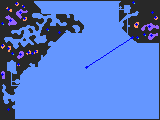

# TerrainForge Showcase

## Showcase 1: Multi-Algorithm Semantic Analysis

TerrainForge provides **13+ procedural generation algorithms** with intelligent **semantic analysis** that understands and classifies the generated terrain.

### Cellular Automata → Cave Systems

*16 regions classified as Chambers, Tunnels, Alcoves, and Crevices with 4 strategic markers*

### BSP Trees → Structured Dungeons  

*Walkable zones and no-spawn areas automatically identified*

### Room Accretion → Organic Layouts

*3 organic regions with natural room-to-hall transitions*

### Maze Generation → Path Networks

*Junction analysis with connectivity graph visualization*

---

## Showcase 2: Advanced Pipeline Composition

**Chain multiple algorithms** together for complex, layered terrain generation with full semantic understanding.

### BSP + Cellular → Structured Caves
```rust
// Generate structured rooms, then apply cellular automata for organic feel
let (grid, semantic) = generate_pipeline("bsp > cellular", 80, 60, seed);
```


### Rooms + Voronoi → Organic Territories  
```rust
// Create rooms, then apply Voronoi for territorial boundaries
let (grid, semantic) = generate_pipeline("rooms | voronoi", 80, 60, seed);
```


### Multi-Stage Complex Pipeline
```rust
// Three-stage generation: caves → rooms → territories
let (grid, semantic) = generate_pipeline("cellular > rooms > voronoi", 80, 60, seed);
```


---

## Key Features Demonstrated

✅ **13+ Generation Algorithms** - Cellular, BSP, Maze, Rooms, Voronoi, DLA, Drunkard Walk, and more  
✅ **Semantic Analysis** - Automatic region classification and marker placement  
✅ **PNG Visualizations** - Color-coded regions, walkable masks, connectivity graphs  
✅ **Pipeline Composition** - Chain algorithms with `>` (sequential) and `|` (parallel)  
✅ **Framework Agnostic** - Works with any grid source or game engine  
✅ **Configurable Systems** - Algorithm-specific optimizations and parameters

*Generate these examples yourself: `cd demo && ./scripts/generate_showcase.sh`*
